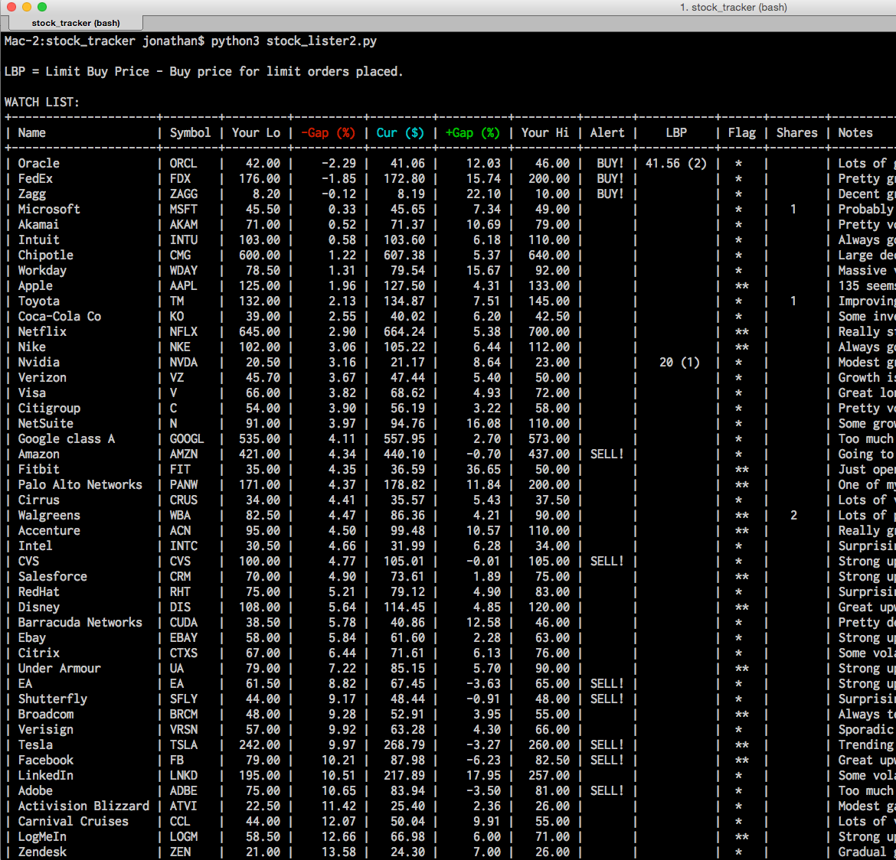

# Stock Portfolio Manager / Watcher
Playing around with Yahoo Finance YQL API to make a stock portfolio / watchlist interface.

Outdated demo screen:


Data is in JSON as below for each stock:

```json
[
  {
    "name":"Apple",
    "symbol":"AAPL",
    "low_price":"125",
    "high_price":"133",
    "notes":"135 seems to be a mental barrier for people here.",
    "shares":"0",
    "flag":"**",
    "lim_buy_price":""
  },

...
]
```
